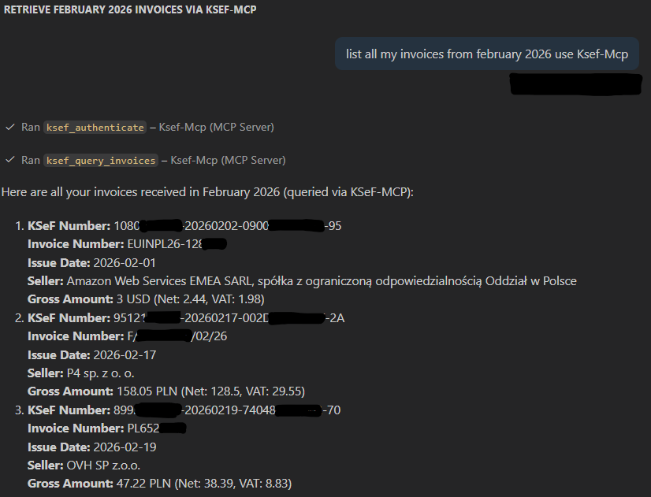

# ksef-mcp

MCP server for read-only access to Polish KSeF (Krajowy System e-Faktur / National e-Invoice System).

## My DEV Configuration
- Build 
- enter your NIP, token, and environment in `claude-code/.mcp.json` (or use environment variables directly)
- Restart Claude Code to pick up the new MCP server configuration
- Run Commands like `/last-received` 

## Configuration

Add to your MCP client configuration (e.g. `claude_desktop_config.json`):

```json
{
  "mcpServers": {
    "ksef": {
      "command": "npx",
      "args": [
        "-y",
        "@mjendza/ksef-mcp@latest"
      ],
      "env": {
        "KSEF_NIP": "1234567890",
        "KSEF_TOKEN": "your-authorization-token-from-ksef-portal",
        "KSEF_ENV": "test"
      }
    }
  }
}
```

### Environment Variables

| Variable | Required | Default | Description |
|---|---|---|---|
| `KSEF_NIP` | Yes | — | Polish Tax Identification Number (NIP, 10 digits) |
| `KSEF_TOKEN` | Yes | — | Authorization token generated in KSeF portal |
| `KSEF_ENV` | No | `test` | Environment: `test`, `demo`, or `prod` |
| `KSEF_BASE_URL` | No | (derived from env) | Override KSeF API base URL |

### KSeF Environments

| Environment | Description |
|---|---|
| `test` | Test environment — free to use, test data |
| `demo` | Demo environment — mirrors production |
| `prod` | Production — legal effect, real invoices |

## Configuration Examples

### Test Environment

```json
{
  "mcpServers": {
    "ksef-test": {
      "command": "npx",
      "args": ["-y", "@mjendza/ksef-mcp@latest"],
      "env": {
        "KSEF_NIP": "1234567890",
        "KSEF_TOKEN": "your-test-token",
        "KSEF_ENV": "test"
      }
    }
  }
}
```

### Production Environment

```json
{
  "mcpServers": {
    "ksef": {
      "command": "npx",
      "args": ["-y", "@mjendza/ksef-mcp@latest"],
      "env": {
        "KSEF_NIP": "your-company-nip",
        "KSEF_TOKEN": "your-production-read-only-token",
        "KSEF_ENV": "prod"
      }
    }
  }
}
```

## Getting a Token

### Test Environment
1. Go to [KSeF Test Portal](https://ksef-test.mf.gov.pl/)
2. Log in with your test credentials
3. Navigate to token management
4. Generate an authorization token with **read-only** permissions
5. Copy the token to your configuration

### Production Environment
1. Go to [KSeF Production Portal](https://ksef.mf.gov.pl/)
2. Log in using your company's credentials (e.g. Profil Zaufany, e-Dowod, or qualified certificate)
3. Navigate to token management
4. Generate an authorization token with **read-only** (odczyt) permissions only
5. Copy the token to your configuration

> **Important:** Production tokens give access to real invoices with legal effect. Use read-only scope to prevent accidental invoice submissions.

## Available Tools

### Session Management
- **`ksef_authenticate`** — Authenticate with KSeF and open a session
- **`ksef_session_status`** — Get current session status
- **`ksef_terminate_session`** — Close the current session

### Invoice Operations (Read-Only)
- **`ksef_get_invoice`** — Fetch a single invoice XML by KSeF reference number
- **`ksef_query_invoices`** — Search invoices by date range, NIP, amounts
- **`ksef_session_invoices`** — List invoices in the current session

## Usage Example

After configuring the MCP server, you can interact with KSeF through your AI assistant:

```
User: Authenticate with KSeF and show me invoices from January 2025
Assistant: [calls ksef_authenticate] -> Session opened.
         [calls ksef_query_invoices with dateFrom=2025-01-01, dateTo=2025-01-31, subjectType=subject2]
         -> Found 5 invoices received in January 2025.

User: Show me details of the first invoice.

Assistant: [calls ksef_get_invoice with the KSeF reference number]
         -> Returns full invoice XML with seller, buyer, line items, amounts.
```



## Local Development

### Setup

```bash
git clone https://github.com/your-username/ksef-mcp.git
cd ksef-mcp
npm install
npm run build
```

### Using local build with Claude Desktop / Claude Code

Point the MCP config to your local `node` + built `dist/index.js` instead of `npx`:

```json
{
  "mcpServers": {
    "ksef": {
      "command": "node",
      "args": [
        "D:/dev/mjendza/ksef-mcp/dist/index.js"
      ],
      "env": {
        "KSEF_NIP": "1234567890",
        "KSEF_TOKEN": "your-token",
        "KSEF_ENV": "test"
      }
    }
  }
}
```

### Using local build with Claude Code (`.claude/settings.local.json`)

Create or edit `.claude/settings.local.json` in your home directory:

```json
{
  "mcpServers": {
    "ksef": {
      "command": "node",
      "args": [
        "D:/dev/mjendza/ksef-mcp/dist/index.js"
      ],
      "env": {
        "KSEF_NIP": "1234567890",
        "KSEF_TOKEN": "your-token",
        "KSEF_ENV": "test"
      }
    }
  }
}
```

### Dev workflow

1. Edit sources in `src/`
2. Rebuild: `npm run build` (or `npm run dev` for watch mode)
3. Restart your MCP client to pick up changes

## License

MIT
